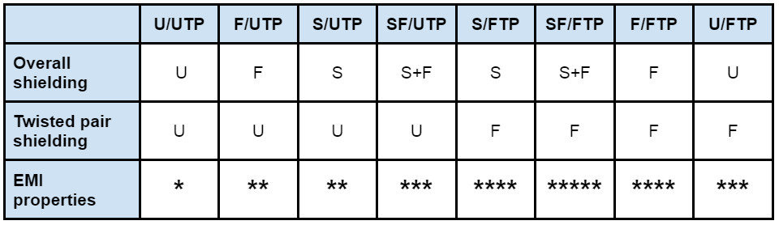
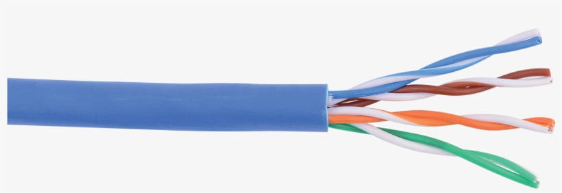
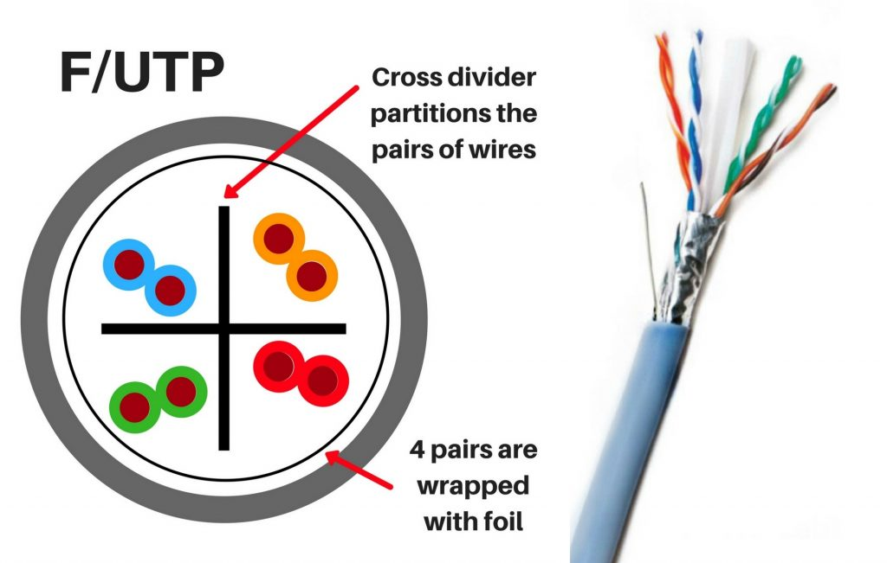
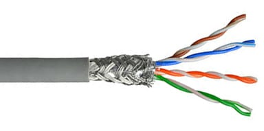
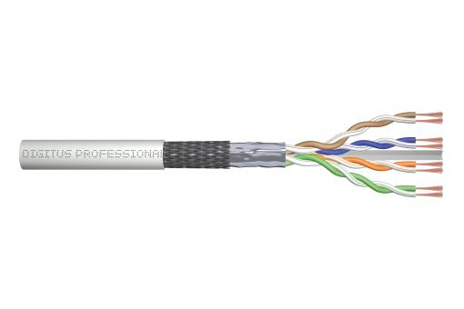
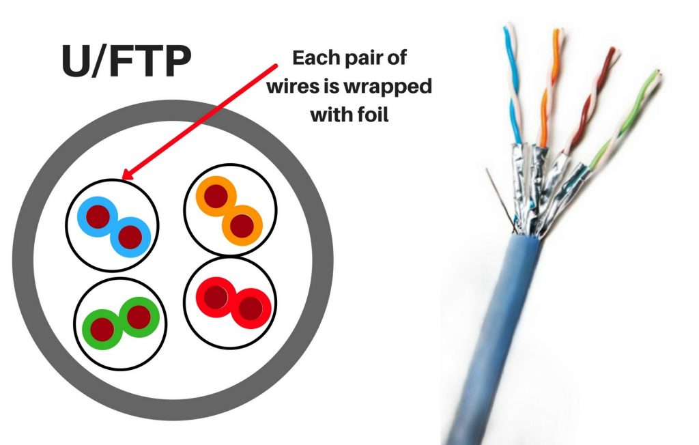
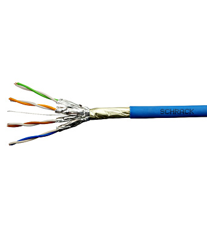
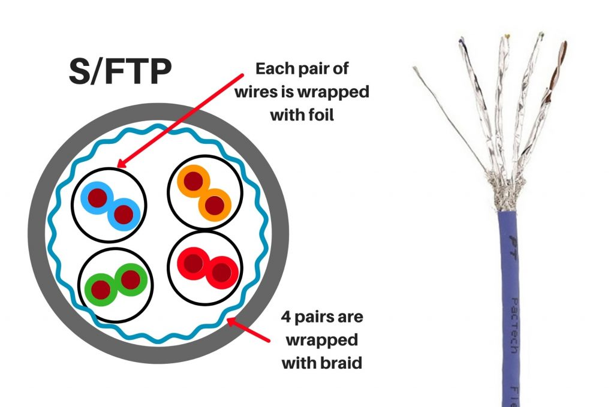
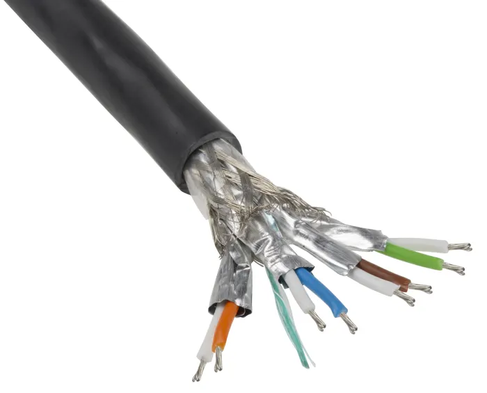

**U** = Unshilded
**F** = Foiled
**S** = Shielded

**TP** = Twisted Pair
**UTP** = Unshilded Twisted Pair
**FTP** = Foiled Twisted Pair
**STP** = Shielded Twisted Pair / Braided

**SF/FTP**
**SF/UTP**

## Cheet Sheet

## U/UTP

**Simple Unshielded TP "Normal" cable**

## F/UTP

**Foiled UTP Puts a layer of Foil to protect it a little**

## S/UTP

**Only Shielded UTP**

## SF/UTP

**Shielded AND foiled UTP**

## U/FTP

**Unshielded Foiled TP puts foil around each cable**

## F/FTP

**Foiled FTP (Foiled pairs and Foiled cable)**

## S/FTP

**Shielded/Braided Foiled TP**

## SF/FTP

**Maximum Reliable cable (SUPER INDUSTRUAL)**

