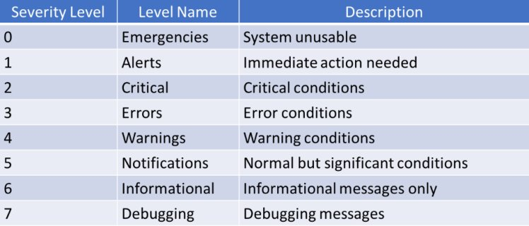

### Show

>\# show Logging

### SysLog Display

Where to display/save syslog

>(conf)# logging console 6 `( 6-0 Severity in console`
>(conf)# logging buffered ["Size"] 7 `( 7-0 severity in RAM`

Extra displays

>(conf)# service timestamps log datetime msec `( shows NTP time`
>(conf)# service sequence-number `(shows seq-num`

### SysLog Server

>(conf)# logging 192.168.1.100 `( SysLog server ip`
>(conf)# logging trap 7

### Terminal Monitor

>(conf)# logging monitor 7 `( enables logging in VTY "ssh/telnet"`
>\# terminal monitor `( do from CLI once. and from VTY Every VTY Login`

### Better Login Display

>(conf)# line console 0
>(line)# logging synchronous

___

