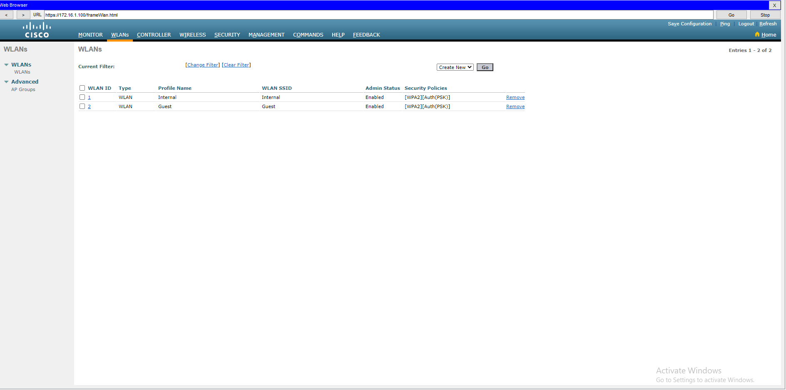

To configure network show in [WLC_Demo](X_files/WLC_Demo.pkt)

### Switch

Config VLANS | 1 For each WLAN | 1 for Management traffic

>(conf)# vlan 99
>(vlan)# name Management

Normal interfaces to AP or PC

>(int)# Switchport access vlan 99

interface to WLC | **LAG** "Etherchannel" Is often configured, but not in packet tracer

>(int)# Switchport mode trunk
>(int)# Switchport trunk allowed vlan 10,20,99
>(int)# Swithport trunk native VLAN 99 `( Native vlan == Management vlan!!! "In .pkt"`

Config SVI's for each VLAN / WLAN

>(conf)# int vlan 10
>(int)# ip addr 10.0.0.1 255.255.255.0

DHCP **Option 43**!

>(conf)# ip dhcp pool vlan 99
>(dhcp)# network 192.168.1.0 255.255.255.0
>(dhcp)# default-router 192.168.1.1

Option 43 if AP is in **different subnet** than WLC!

>(dhcp)# option 43 ip 192.168.1.100 `( WLC IP`

### WLC

Configure WLC ip addr using management tab "in .pkt"
Connect to the WLC Using PC Ethernet port. Access WLC GUI, using wlc IP over http
**! Remember to config PC IP !**

 

Management VLAN **needs to be 0** for untagged in packet tracer.
Therefore NATIVE VLAN should be set to the management VLAN(99).

Apply the changes. It can take some time
Now you can connect **VIA HTTPS** To the WLC. Via any PC in the managment vlan

Here you can create Virtual Interfaces to be used with f.eks your WLAN 
| Contorller -> Interface |

Create WLAN's

