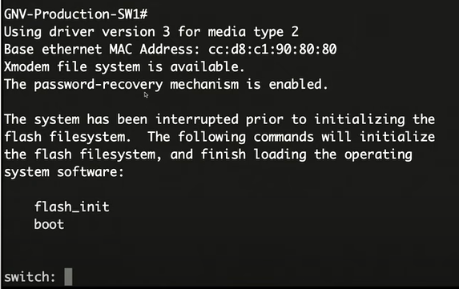

### First
Plug in your console cable and connect to the serial port.
- Use a program like putty or TerraTerm to connect to the serial COM.

Now if you cannot login follow these procedures while still being connected to the serial console port.

1. Unplug the power cable
2. Hold the mode button ( often right beside console port )
3. Plug the power cable back in while still holding the mode button.
4. Watch your terminal for a promt `Switch:` 
( When ariving at such prompt it is safe to let go of the mode button )

Do the following

>flash_init

>dir flash:/

And delete `config.text` and `vlan.dat`

>del flash:config.text

>del flash:vlan.dat

Then boot. Everything should be reset to factory settings. 

>boot

