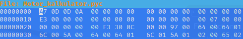
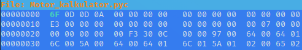

### Decompiling .exe files made in python

We will take a look at decompiling an **.exe** file made in python using **PyInstaller**


- First Extracting the python **PYC file** from the .exe
- Then Decompiling the PYC file

"Python version working for, depends on decompiler(pycdc in this case)"

**Tools needed**
- Linux VM ( For this demonstration )
- [pyinstxtractor](https://github.com/extremecoders-re/pyinstxtractor)
- [**pycdc**](https://github.com/zrax/pycdc) or *uncompyle6* for ease of use `pip install` 

# Extracting PYC from .exe

##### pyinstxtractor install

```
$ git clone https://github.com/extremecoders-re/pyinstxtractor
```

## Extracting PYC

You should have a pyinstxtractor.py file in your pyinstxtractor directory. Run it using

```
$ python pyinstxtractor file.exe
```

> and the file should be in `file.exe_extracted/file.pyc`

**-> USE THE CORRECT VERSION OF PYTHON <-** The same version as the one making the .exe file used. (" If unknown extract it anyway and see [Magic number](Hacking%20Documentation/Bad%20Magic%20number) then come back to this step again")

```
$ python3.10 pyinstxtractor file.exe
```

# Decompiling PYC file

##### pycdc install

```
$ git clone https://github.com/zrax/pycdc.git
```

```
$ cd pycdc
```

```
$ mkdir build
```

```
$ cd build
```

```
$ cmake ..
```

```
$ make
```

## Decompiling PYC files

You should have a file named **pycdc** in `~/pycdc/build`
Now run pycdc providing the PYC file

```
$ ./pycdc /home/kali/pyinstxtractor/file.exe_extracted/file.pyc
```

**CONGRATS** You have just decompiled an .exe file made from PyInstaller

___
# Troubleshooting
___


If you get an error of 

```
Bad MAGIC!
Could not load file
```

It is because the python version numbers are mismatched AKA "Magic numbers"


### `1` Bad magic number error

This problem is caused by running an invalid version of python. f.eks running a 3.11 PYC file with python 3.10

> You can extract a PYC file using the correct version "BEST WAY"

```
$ python3.11 pyinstxtractor.py "FILE" 
```

### `1.1` Changing magic number

Referense article: [shakaraman](https://shankaraman.wordpress.com/tag/how-to-fix-runtimeerror-bad-magic-number-in-pyc-file/)

**Manually change the magic number**
Magic numbers are the first 2 bytes of a PYC file indicating version. 

This python code can be used to figure out what those 2 bytes are in hex
--or use
[List of some version number](https://raw.githubusercontent.com/google/pytype/master/pytype/pyc/magic.py) F.eks (python3.10 = somewhere between 3430 - 3439)

```
>>> int('0D6F',16)
3439
```

**3439** is the version magic number

**0D6F** is the first 2 bytes of the PYC file, indicating the version number in hex
"rearanged a bit" would be written in hex ( 6F0D )

you can edit the PYC file hex'es using
```
$ hexeditor file.pyc
```

Version 3.11



You can edit the first 2 bytes / 4 hex coresponding to the version number

version3.10


